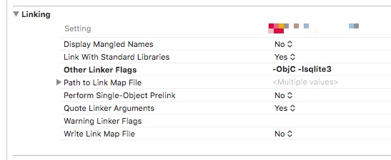
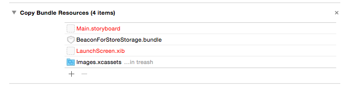
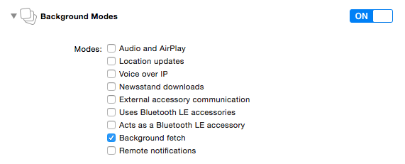

# Hardware & software requirements

 The Neerby SDK uses Bluetooth 4.0 BLE (Bluetooth Low Energy) and thus is only available on the following devices:
 
  * iPhone 4S and up
  * iPod Touch 5th generation and up
  * iPad 3rd generation and up
  * iPad mini (all versions)
  
  Minimum iOS target : iOS 7
  
  Xcode 6 or higher is required for development
  
  The Neerby SDK supports App Transport Security, no exception is required

# Installation

You must perform the following tasks to integrate the Neerby SDK with your application:

 * Get your application ID
 * Import required frameworks & BeaconForStoreStorage.bundle manually or using <a href="https://cocoapods.org">Cocoa Pods</a>
 * Configure application modes
 * Allow location usage
 * Code-level integration
 
## Get your application ID

In order to use the SDK you must know the application ID that is tied to your Neerby account. 

### Using the web interface

 * Go to <a href="https://manager.neer.by">https://manager.neer.by</A>
 * Log-in with your Neerby account
 * Go to the "Applications" section
 * Select your application ID

### Using Neerby Manager

 * Install the <a href="https://itunes.apple.com/fr/app/b4s-manager/id903400204?mt=8">Neerby Manager</a> app from the App Store
 * Log-in with your Neerby account
 * Go to the "Applications" section
 * Tap on your application
 * Use the "Share" button on the "Application ID" section to send the application ID to yourself as an email.

## Adding the files manually

Use the following instructions to manually add the SDK to your project

### Import frameworks

 * Download the lastest version from <a href="https://github.com/ezeeworld/B4S-iOS-SDK/releases">Git Hub</a>
 * Extract the zip archive
 * Drag & drop the BeaconForStoreSDK.framework onto your project
 * Check the "Copy items if needed" box
 * Add the Framework to your application target
 * Click "Finish"
 
### Add linker flags

 * Open Project Settings -> Build Settings
 * Scroll to the "Linking" section
 * In "Other Linker Flags" add "-ObjC" (this setting is case-sensitive) and "-lsqlite3"
 
     

### Import BeaconForStoreStorage.bundle

 * Drag & drop the BeaconForStoreStorage.bundle onto your project
 * Check the "Copy items if needed" box
 * Add the bundle to your application target
 * Click "Finish"
 * Check if the bundle appears in the "Copy File" step of your application target
 

## Use Cocoa Pods

 * Add   pod 'BeaconForStoreSDK' to the "target" section of your podfile
 * Run the pod install command

## Configure application modes

To be able to track the beacons even when in background mode, you must enable background modes in your application.

 * Select your project in the Project navigator
 * Select your application target
 * Select the "Capabilities" tab
 * Turn on "Background Modes"
 * Check the "Background fetch" mode
 
 
 
 The application will be started by iOS when entering a geofence region or detecting an iBeacon, thus the didFinishLaunchingWithOptions: method from your app delegate will be called.

 So if your app calls a tagging / analytics tool (Flurry, Google Analytics...) from this method, your metrics will be eroneous. You should use the  'applicationWillEnterForeground' delegate method to track application launches instead.
 
## Add keys to Info.plist

Starting with iOS8, you **must** add a key to your Info.plist to be able to get the user location.

 * Open your Info.plist file
 * Add a NSLocationAlwaysUsageDescription key
 * Set its value to a string describing the reason for accessing the user’s location information

 The Backgound Location is need by the SDK to allow a caching mechanism of the contextual contents associated to the iBeacon around the user. By using this cache, the SDK deals with the scalability of the contextual contents produced in the Neerby plateform (not all the contents available are downloaded into all active user smartphone) , and allow the user to receive the content when he comes in range of the known iBeacon, even if he has no network at this stage (ie. inside a store)
 
Please see <a href="https://developer.apple.com/library/ios/documentation/General/Reference/InfoPlistKeyReference/Articles/CocoaKeys.html">this document</a> for more information

Starting with iOS 10 (and app compiled with the Xcode 8 toolchain) you must explain why you app uses Bluetooth otherwise the binary is rejected on iTunes Connect

 * Open your Info.plist file
 * Add a NSBluetoothPeripheralUsageDescription key
 * Set its value to a string describing the reason for accessing Bluetooth
