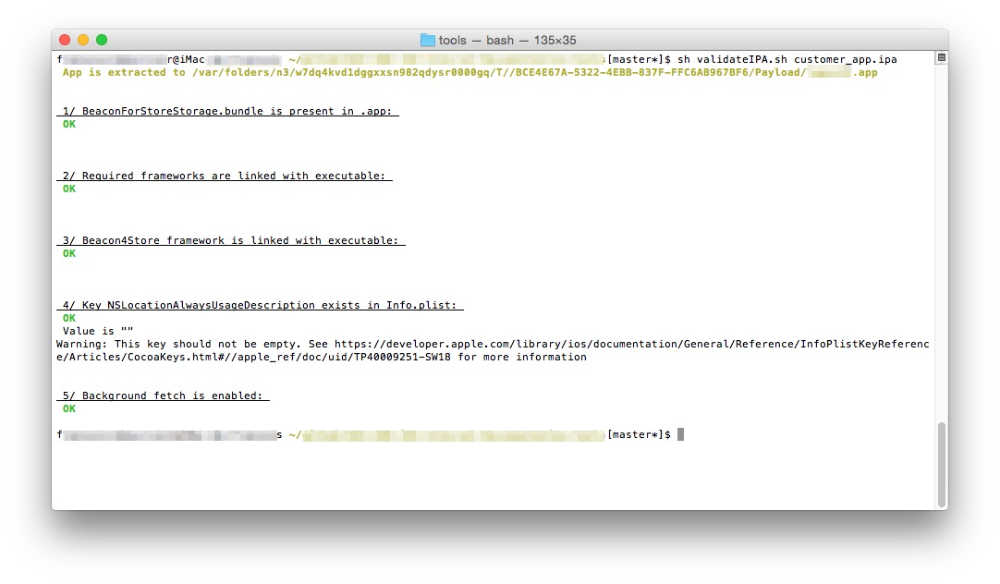

When integrating the BeaconForStore SDK with your application, you must pay attention to the following instructions or the integration will fail or the user experience won't be up-to-par.

## Analytics tools (Flurry, Google Analytics...)

The application will be started by iOS when entering a geofence region or detecting an iBeacon, thus the didFinishLaunchingWithOptions: method from your app delegate will be called.

So if your app calls a tagging / analytics tool (Flurry, Google Analytics...) from this method, your metrics will be eroneous.

## B4SBehaviours

On first application launch, an dialog will be shown to the user to allow the app to use his geolocalisation. By default, no alerts are displayed if Bluetooth is disabled or if notifications are not enabled. To manage such alerts, use the B4SBehaviours class to manage the interval at wich you want thos alerts to be displayed.

B4SBehaviours methods **must** be called before initializing the SDK with the [B4SSingleton setupSharedInstanceWithAppId:] method

## Validation tool

A tool is available to check if your app is properly configured to use the Beacon4Store SDK. This tools does *not* make a code-level check: make sure to follow the instructions from the "Using the SDK" document

To use this tool:

 * Download it from <a href="tools/validateIPA.sh">here</a>
 * Start it with the following command:
 
 	sh	validateIP.sh <path-to-your-ipa>

 * The tool will highlight errors (if any) and refer you to the proper documentation section

