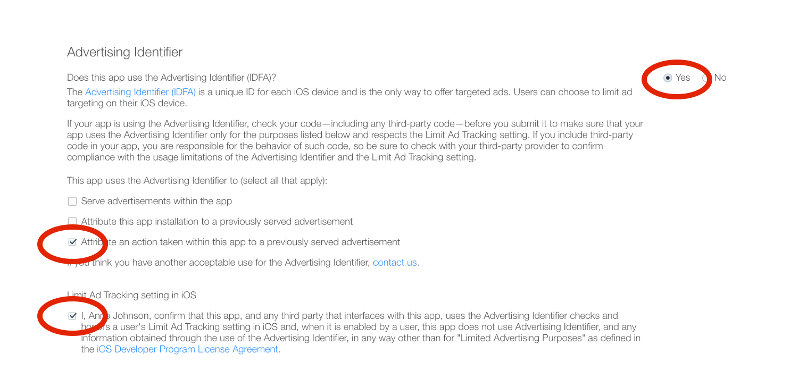

The BeaconForStore SDK uses the Advertising Identifier (IDFA). When submiting your app to Apple for the AppStore review, you must enable the settings circled in the screenshot below in additions to the uses your app already requires.

