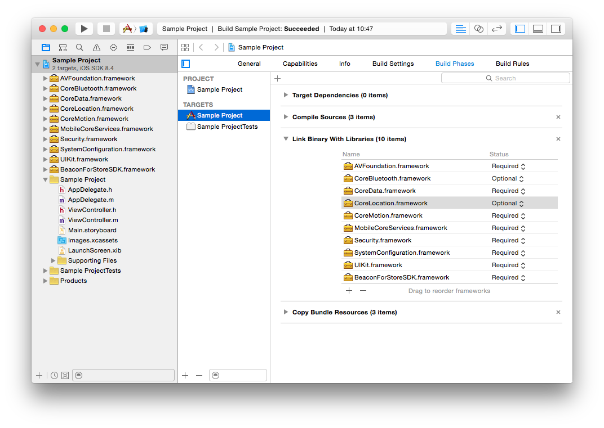

# Hardware & software requirements

 The B4S SDK uses Bluetooth 4.0 BLE (Bluetooth Low Energy) and thus is only available on the following devices:
 
  * iPhone 4S and up
  * iPod Touch 5th generation and up
  * iPad 3rd generation and up
  * iPad mini (all versions)
  
  Minimum iOS target : iOS 7
  Xcode 6 is required for development

# Installation

You must perform the following tasks to integrate the BeaconForStore SDK with your application:

 * Get your application ID
 * Import required frameworks
 * Import BeaconForStoreStorage.bundle
 * Configure application modes
 * Allow location usage
 * Code-level integration

## Get your application ID

In order to use the SDK you must know the application ID that is tied to your BeaconForStore account. To get this App ID:

 * Install the <a href="https://itunes.apple.com/fr/app/b4s-manager/id903400204?mt=8">B4SManager</a> app from the App Store
 * Log-in with your B4S account
 * Go to the "Applications" section
 * Tap on your application
 * Use the "Share" button on the "Application ID" section to send the application ID to yourself as an email.

## Import frameworks

 * Open your Xcode project
 * Select your project in the Project navigator
 * Select your application target
 * Select the "Build phase" tab
 * Open Project Settings -> Build Phases
 * Unfold the "Link Binary With Libraries" phase
 * Click '+'
 * Click "Add Other..."
 * Select the **BeaconForStoreSDK.framework** on your drive
 * Click "+" again
 * Select the following frameworks:
   * AVFoundation.framework
   * CoreBluetooth.framework
   * CodeData.framework
   * CoreLocation.framework
   * CoreMotion.framework
   * MobileCoreService.framework
   * Security.framework
   * SystemConfiguration.framework
   * UIKit.framework
 * Set the framework status to "Optional" for the following frameworks:
   * CoreBluetooth.framework
   * CoreLocation.framework 

  
## Import BeaconForStoreStorage.bundle

 * Drag & drop the BeaconForStoreStorage.bundle onto your project
 * Check the "Copy items if needed" box
 * Add the project to your application target
 
## Configure application modes

To be able to track the beacons even when in background mode, you must enable background modes in your application.

 * Select your project in the Project navigator
 * Select your application target
 * Select the "Capabilities" tab
 * Turn on "Background Modes"
 * Check the "Background fetch mode"
 
 
 
 The application will be started by iOS when entering a geofence region or detecting an iBeacon, thus the didFinishLaunchingWithOptions: method from your app delegate will be called.

 So if your app calls a tagging / analytics tool (Flurry, Google Analytics...) from this method, your metrics will be eroneous. You should use the  'applicationWillEnterForeground' delegate method to track application launches instead.
 
## Allow location usage

Starting with iOS8, you must add a key to your Info.plist to be able to get the user location.

 * Open your Info.plist file
 * Add a NSLocationAlwaysUsageDescription key
 * Set its value to a string describing the reason for accessing the user’s location information
 
Please see <a href="https://developer.apple.com/library/ios/documentation/General/Reference/InfoPlistKeyReference/Articles/CocoaKeys.html#//apple_ref/doc/uid/TP40009251-SW18">this document</a> for more information

## Code-level integration

Refer to <a href="Using-the-SDK.html">this document</a> 