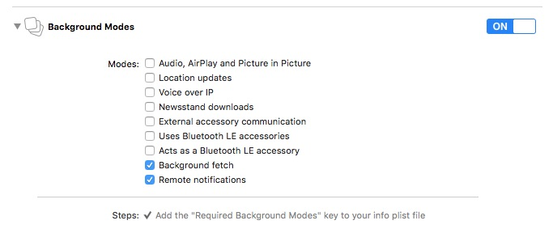

Depending on how you use the B4S SDK, some steps are mandatory, some are optional.

 * Base integration for counting visits
 * Recording user data
 * Beacon-based notifications
 * Application tagging
 * Push notifications

# Base integration

The base integration requires the following steps.

 * Import the Framework In your AppDelegate.m

<pre><code>
	@import BeaconForStoreSDK;
</pre></code>

<pre><code class="swift">
	@import BeaconForStoreSDK
</code></pre>

 *  Initialize and start the SDK in the application:didFinishLaunchingWithOptions: method: 

<pre><code>
	//Replace MY-APP-ID with the ID associated with your BeaconForStore account
	[B4SSingleton setupSharedInstanceWithAppId:@"MY-APP-ID"];
	[[B4SSingleton sharedInstance] startStandAloneMode];
</pre></code>

<pre><code class="swift">
	//Replace MY-APP-ID with the ID associated with your BeaconForStore account
	B4SSingleton.setupSharedInstanceWithAppId("MY-APP-ID")
	B4SSingleton.sharedInstance().startStandAloneMode()
</code></pre>

# Recording user data

B4S can relate events tot individual customers. Supplying the customer details is typically done on startup and/or after a user signed in to his/her account. In these cases you can update te SDK with this customer data (which is persisted; no need to call this every time). The key should use reverse-dns-like notation to be used as a domain. For instance, the user hometown should use a "user.hometown" key.

<pre><code>
	[[B4SSingleton sharedInstance] setUserName:@"Bernard" firstName:@"VanCode" gender:B4SCustomerGender_MALE email:@"bernard@vancode.com" customerRef:@"90210"];
    [[B4SSingleton sharedInstance] setUserProperty:kB4SUserPropertyUserFirstNameKey withString:@"Bernard"];
           [[B4SSingleton sharedInstance] setUserProperty:kB4SUserPropertyUserLastNameKey withString:@"VanCode"];
           [[B4SSingleton sharedInstance] setUserProperty:kB4SUserPropertyUserGenderKey withGender:B4SCustomerGender_MALE];
           [[B4SSingleton sharedInstance] setUserProperty:kB4SUserPropertyUsereMailKey withString:@"bernard@vancode.com"];
           [[B4SSingleton sharedInstance] setUserProperty:kB4SUserPropertyUserCustomerRefNameKey withString:@"90210"];
</pre></code>

<pre><code class="swift">
	B4SSingleton.sharedInstance().setUserProperty(kB4SUserPropertyUserFirstNameKey, withString: "Bernard")
	B4SSingleton.sharedInstance().setUserProperty(kB4SUserPropertyUserLastNameKey, withString: "VanCode")
	B4SSingleton.sharedInstance().setUserProperty(kB4SUserPropertyUserGenderKey, withGender: B4SCustomerGender_MALE)
	B4SSingleton.sharedInstance().setUserProperty(kB4SUserPropertyUsereMailKey, withString: "bernard@vancode.com")
	B4SSingleton.sharedInstance().setUserProperty(kB4SUserPropertyUserCustomerRefNameKey, withString: "90210")
</code></pre>

# Beacon-based notifications

The B4S SDK uses local notifications to establish communication between beacons and the app.

Implement the application:didReceiveLocalNotification: method in your appDelegate. A notification will be sent by the SDK when a notification is fired. You can use the UILocalNotification.userInfo to process the notification yourself. But if you set up some automatic action in the B4S Manager application or using the web app, you must call the [B4SSingleton notificationFeedback:] method. So, the SDK will display a confirmation panel (if any) and process one of the requested predefined actions.

<pre><code>
	- (void)application:(UIApplication *)application didReceiveLocalNotification:(UILocalNotification *)notification
	{
	    [[B4SSingleton sharedInstance] notificationFeedback:notification.userInfo];
	}
</code></pre>
<pre><code class="swift">
	func    application(application: UIApplication, didReceiveLocalNotification notification: UILocalNotification) {
		B4SSingleton.sharedInstance().notificationFeedback(notification.userInfo)
	}
</code></pre>
After processing a notification, a kB4SNotificationProcessedNotification event is fired by the SDK. The notification type is a B4SActionType that you can get using [[notificationData.userInfo objectForKey:kB4SNotifActionId] intValue]

# Application tagging

You can tag your application with the B4S SDK. You can set two values : The first parameter is the event descriptor and the second the userData asociated to the event. Use the [B4STag event:userData:] and  [B4STag event:userData:]  methods

<pre><code>
	[B4STag event:@"menuClose" userData:@"menu_id_42"];
	[B4STag event:@"menuOpen" userDict:@{@"menu_id": @(42), @"item_id": @(12)}];
</code></pre>
<pre><code class="swift">
	B4STag.event("menuClose", userData: "menu_id_42")
	B4STag.event("menuOpen", userData: ["menu_id" : 42, "item_id": 12])
</code></pre>
 
# B4S Behaviours

This feature allows you to automatically warn the user if Bluetooth, notifications or geolocation are disabled. This setup **must** be done before initializing the B4S Singleton. See the B4SBehaviours class for more details.
<pre><code>
	[B4SBehaviours warnForBluetooth:true after:0 count:2 andEvery:2 withTitle:@"Bluetooth" andText:@"Bluetooth is disabled. Do you want to enable it ?"];
	[B4SBehaviours warnForGeolocation:true after:3 count:2 andEvery:2 withTitle:@"Geoloc" andText:@"Geolocation is disabled. Do you want to enable it ?"];
	[B4SBehaviours warnForNotifications:true after:1 count:2 andEvery:2 withTitle:@"Notifications" andText:@"Notifications are disabled. You need to activate them in order to use this application."];
</code></pre>
<pre><code class="swift">
	B4SBehaviours.warnForBluetooth(true, after: 0, count: 2, andEvery: 2, withTitle: "Bluetooth", andText: "Bluetooth is disabled. Do you want to enable it ?")
	B4SBehaviours.warnForGeolocation(true, after: 3, count: 2, andEvery: 2, withTitle: "Geoloc", andText: "Geolocation is disabled. Do you want to enable it ?")
	B4SBehaviours.warnForNotifications(true, after: 1, count: 2, andEvery: 2, withTitle: "Notifications", andText: "Notifications are disabled. You need to activate them in order to use this application")
</code></pre>

# Custom notifications

You can customize the notification messages and data sent to your application

 *  Implement B4SDelegate in your app delegate
<pre><code>
	@interface AppDelegate : UIResponder <UIApplicationDelegate,B4SDelegate>
</code></pre>
<pre><code class="swift">
	class AppDelegate: UIResponder, UIApplicationDelegate, B4SDelegate {
</code></pre>		
 * In your application:didFinishLaunchingWithOptions: method: set the singleton delegate to your app delegate *after* calling [B4SSingleton setupSharedInstanceWithAppId:]
<pre><code>
	[B4SSingleton sharedInstance].delegate = self;		
</code></pre>
<pre><code class="swift">
	B4SSingleton.sharedInstance().delegate = self
</code></pre>			

 * Implement the [B4SDelegate customizeNotificationText:andData:andUserInfo:completion:] in your app delegate

<pre><code>
	- (void)customizeNotificationText:(NSString *)aText
	                          andData:(NSString *)aData
	                      andUserInfo:(NSMutableDictionary *)userInfos
	                       completion:(void (^)(NSString *pushText, NSString *pushData, NSMutableDictionary *userInfos))completion {
	    if (completion) {
	        NSLog(@"[customizeNotificationText] surround notification text with braces");
	        completion([NSString stringWithFormat:@"[%@]",aText], aData, userInfos);
	    }
	}
</code></pre>
<pre><code class="swift">
	func        customizeNotificationText(aText: String!, andData aData: String!, andUserInfo userInfos: NSMutableDictionary!, completion: ((String!, String!, NSMutableDictionary!) -> Void)!) {
	        if completion {
	            print("customizeNotificationText: surround notification text with braces")
	            completion("[\(aText)]", aData, userInfos)
	        }
	    }
</code></pre>			

# Custom alert sound

 * Change the sound played when you app shows a notification to the user. The sound file must be in .caf (Core Audio File) format and imported into your project
<pre><code>
	[[B4SSingleton sharedInstance] setNotificationSoundname:@"sound.caf"];
</code></pre>
<pre><code class="swift">
	B4SSingleton.sharedInstance().notificationSoundname = "sound.caf"
</code></pre>		

# Push notifications

*To use remote push notifications you must first follow the instructions of the "Base integration" and "Beacon-based notifications" sections*

## Certificates

 * Follow <A href="https://developer.apple.com/library/ios/documentation/NetworkingInternet/Conceptual/RemoteNotificationsPG/Chapters/ProvisioningDevelopment.html#//apple_ref/doc/uid/TP40008194-CH104-SW1"> Apple Developer documentation</A> on how to get Certificates for push notifications

## Target configuration

 * Select your application target
 * Select the "Capabilities" tab
 * Set Push Notifications to "On"
	 
 * In Background Modes enable "Remotes Notifications" in addition to "Background Fetch"
	 

## Code

 * After initializing the SDK with the setupSharedInstanceWithAppId: call enablePushNotifications:
 <pre><code>[[B4SSingleton sharedInstance] enablePushNotifications];
</code></pre>

<pre><code class="swift">B4SSingleton.sharedInstance().enablePushNotifications()
</code></pre>	

 * Implement application:didRegisterForRemoteNotificationsWithDeviceToken: in your app delegate:
 <pre><code>	 - (void)application:(UIApplication *)application didRegisterForRemoteNotificationsWithDeviceToken:(NSData *)deviceToken
	 {
		[[B4SSingleton sharedInstance] registerPushNotificationDeviceToken:deviceToken];
	 }
 </code></pre>
 <pre><code class="swift">	 func application(application: UIApplication, didRegisterForRemoteNotificationsWithDeviceToken deviceToken: NSData) 
	 {
		 B4SSingleton.sharedInstance().registerPushNotificationDeviceToken(deviceToken)
	 }
 </code></pre>	
 
 * Implement application:didReceiveRemoteNotification: in your app delegate:
  <pre><code>	  - (void)application:(UIApplication ​*)application didReceiveRemoteNotification:(NSDictionary *​)userInfo
	  {
		  [B4SSingleton sharedInstance] notificationFeedback:userInfo];
	  }
  </code></pre>
  <pre><code class="swift">	  func application( application: UIApplication, didReceiveRemoteNotification userInfo: [NSObject : AnyObject])
	  {
		  B4SSingleton.sharedInstance().notificationFeedback(userInfo)
	  }
  </code></pre>